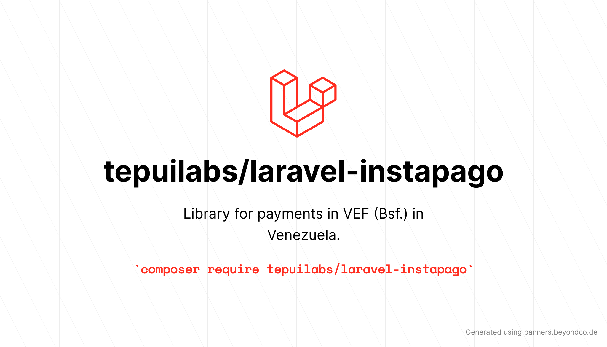

<p align="center">
	
</p>


# Library for payments in VEF (Bsf.) in Venezuela.

[](https://packagist.org/packages/tepuilabs/laravel-instapago)
[](https://github.com/TepuiLABS/laravel-instapago/actions?query=workflow%3ATests+branch%3Amaster)
[](https://packagist.org/packages/tepuilabs/laravel-instapago)


Library for payments in VEF (Bsf.) in Venezuela.


## Installation

You can install the package via composer:

```bash
composer require tepuilabs/laravel-instapago
```

You can publish the config file with:
```bash
php artisan vendor:publish --provider="Tepuilabs\LaravelInstapago\LaravelInstapagoServiceProvider" --tag="config"
```

This is the contents of the published config file:

```php
return [
    'key_id'           => env('INSTAPAGO_KEY_ID'),
    'public_key_id'    => env('INSTAPAGO_PUBLIC_KEY_ID'),
];
```

## Usage

```php
use \Instapago\Instapago\Exceptions\{
	InstapagoException,
	AuthException,
	BankRejectException,
	InvalidInputException,
	TimeoutException,
	ValidationException,
	GenericException,
};

$paymentData = [
    'amount' => '200',
    'description' => 'test',
    'card_holder' => 'jon doe',
    'card_holder_id' => '11111111',
    'card_number' => '4111111111111111',
    'cvc' => '123',
    'expiration' => '12/2020',
    'ip' => '127.0.0.1',
];

try{

    $response = LaravelInstapago::directPayment($paymentData);
    // hacer algo con $respuesta
}catch(InstapagoException $e){

  echo $e->getMessage(); // manejar el error

}catch(AuthException $e){

  echo $e->getMessage(); // manejar el error

}catch(BankRejectException $e){

  echo $e->getMessage(); // manejar el error

}catch(InvalidInputException $e){

  echo $e->getMessage(); // manejar el error

}catch(TimeoutException $e){

  echo $e->getMessage(); // manejar el error

}catch(ValidationException $e){

  echo $e->getMessage(); // manejar el error

}catch(GenericException $e){

  echo $e->getMessage(); // manejar el error

}

```

> TODO: add more docs

## Testing

```bash
composer test
```

## Changelog

Please see [CHANGELOG](CHANGELOG.md) for more information on what has changed recently.

## Contributing

Please see [CONTRIBUTING](.github/CONTRIBUTING.md) for details.


## Credits

- [angel cruz](https://github.com/abr4xas)
- [All Contributors](../../contributors)

## License

The MIT License (MIT). Please see [License File](LICENSE.md) for more information.
